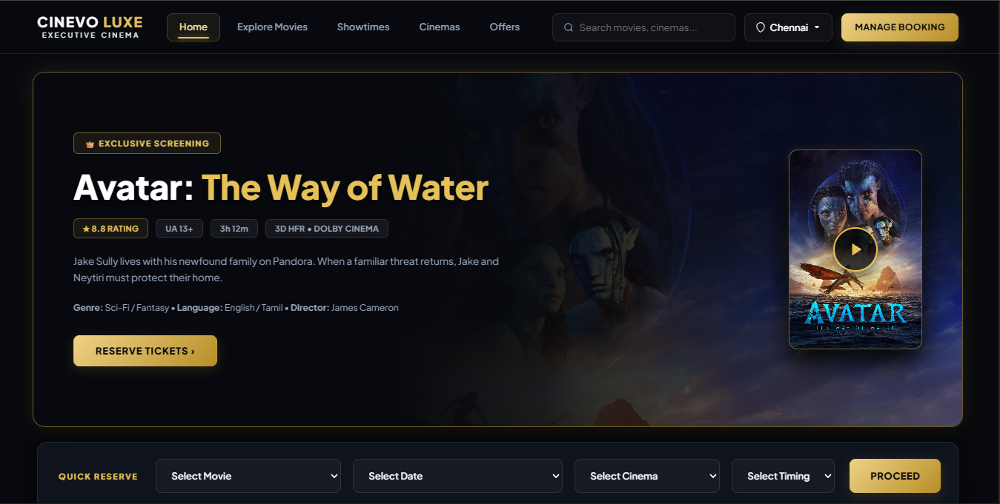
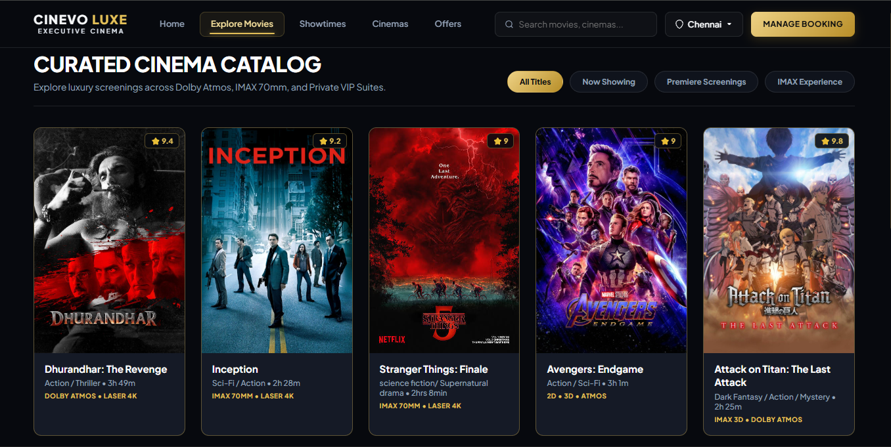
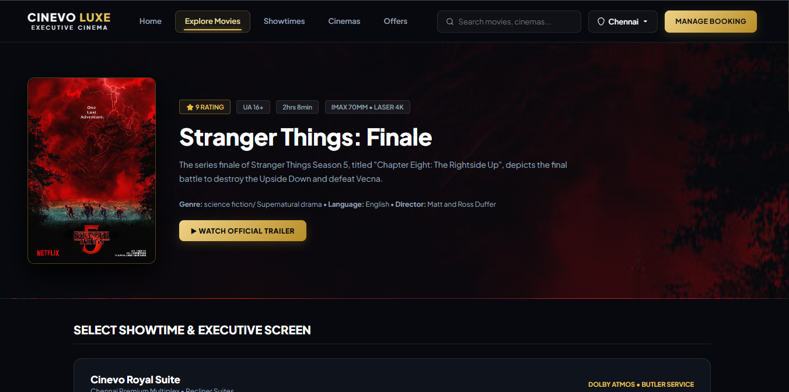
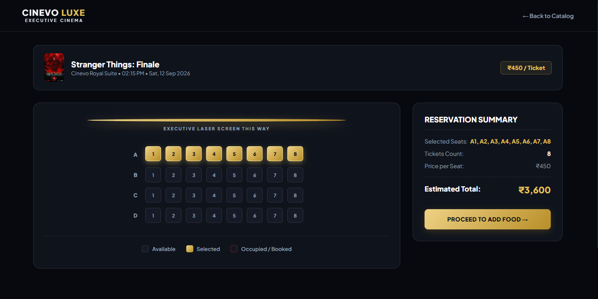
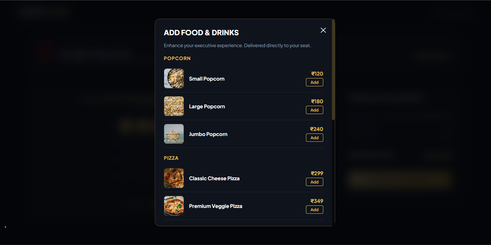
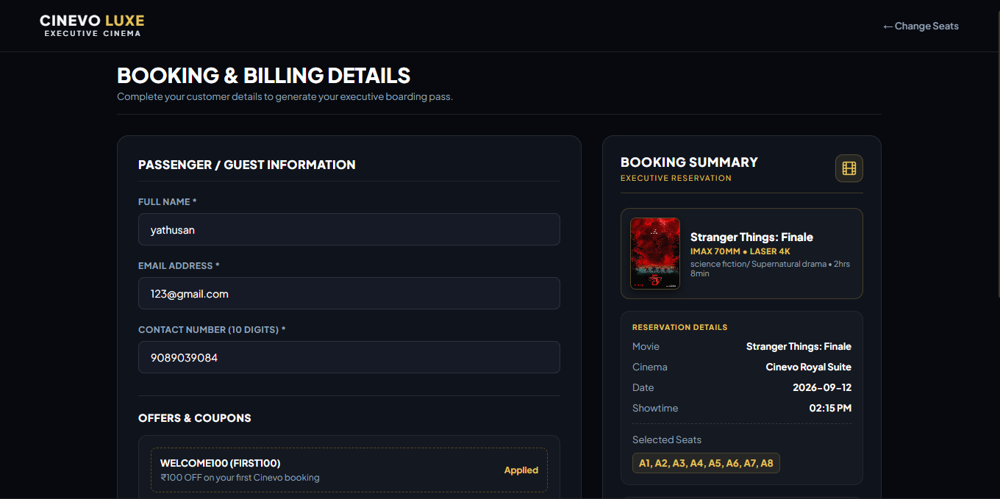
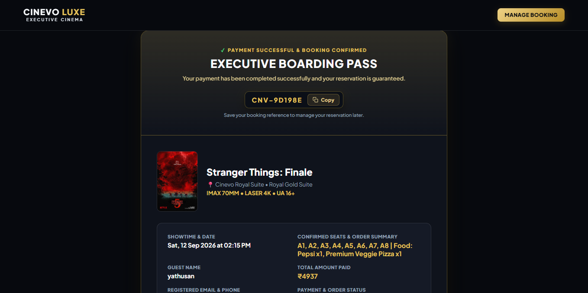

# 🎬 CINEVO LUXE

### Full-Stack Cinema Ticket Booking & Reservation Platform

**CINEVO LUXE** is a full-stack cinema booking application built with **Python, Flask, SQLAlchemy, SQLite, HTML, CSS, and JavaScript**.

The project implements a complete cinema reservation workflow—from discovering movies and selecting showtimes to choosing seats, validating booking data, processing reservations, and generating digital booking confirmations.

It also includes a **protected staff administration portal** for managing movies, cinemas, showtimes, and booking-related operations.

> **The browser provides the interface. The server enforces the rules.**

---

## 🌐 Live Application

**[cinevo-luxe.onrender.com](https://cinevo-luxe.onrender.com)**

## 💻 Source Code

**[GitHub Repository](https://github.com/Yathusan-tech/cinevo-luxe)**

---

# 📌 Project Overview

This project was designed to demonstrate practical **full-stack software engineering**, rather than only frontend development.

The application combines:

* 🎨 Frontend user experience
* ⚙️ Backend business logic
* 🗄️ Database persistence
* 💺 Interactive seat reservation
* 💳 Server-side price calculation
* 🔐 Authentication and authorization
* 🛡️ Security controls and validation
* 👨‍💼 Protected staff administration
* ☁️ Cloud deployment

The core design principle is that important application decisions are enforced by the backend instead of trusting browser-submitted data.

---

# 🛠️ Technology Stack

| Area                 | Technologies                                                   |
| -------------------- | -------------------------------------------------------------- |
| **Backend**          | Python, Flask                                                  |
| **ORM / Data Layer** | Flask-SQLAlchemy, SQLAlchemy                                   |
| **Database**         | SQLite                                                         |
| **Frontend**         | HTML5, CSS3, JavaScript                                        |
| **Authentication**   | Werkzeug password hashing                                      |
| **Security**         | CSRF protection, validation, security headers, secure sessions |
| **Deployment**       | Render, Gunicorn                                               |
| **Version Control**  | Git, GitHub                                                    |

---

# ✨ Key Features

## 🎟️ Customer Experience

* Browse available movies
* View movie details
* Browse cinemas and showtimes
* Select seats interactively
* View seat availability
* Review booking details at checkout
* Server-side price calculation
* Create reservations
* Generate booking references
* Digital booking confirmation
* QR-based booking representation
* Protected reservation lookup
* Promotional and offer logic
* Food and refreshment selection

## 👨‍💼 Staff Administration

The application includes a separate staff environment protected by backend authentication and authorization.

Staff functionality includes:

* Staff login
* Protected dashboard
* Movie management
* Cinema management
* Showtime management
* Booking administration

---

# 🏗️ System Architecture

```text
                         CINEVO LUXE
                                │
                                ▼
┌─────────────────────────────────────────────────────┐
│                     FRONTEND                        │
│                                                     │
│            HTML5 • CSS3 • JavaScript                │
│                                                     │
│ Movies → Showtimes → Seats → Checkout               │
└──────────────────────────┬──────────────────────────┘
                           │
                           │ HTTP Requests
                           ▼
┌─────────────────────────────────────────────────────┐
│                  FLASK APPLICATION                  │
│                                                     │
│ Routes • Business Logic • Validation                │
│ Authentication • Authorization • Booking Logic      │
│                                                     │
│ Customer Routes • Booking Processing • Staff Routes │
│                                                     │
│ Security Controls                                   │
│ • CSRF Protection                                   │
│ • Input Validation                                  │
│ • Session Security                                  │
│ • Security Headers                                  │
└──────────────────────────┬──────────────────────────┘
                           │
                           ▼
┌─────────────────────────────────────────────────────┐
│                     DATA LAYER                      │
│                                                     │
│          Flask-SQLAlchemy / SQLAlchemy              │
│                                                     │
│ Movie • Cinema • Showtime • Booking • Staff         │
└──────────────────────────┬──────────────────────────┘
                           │
                           ▼
                     SQLite Database
```

### Architecture Responsibilities

**Frontend**
Handles presentation, user interaction, forms, and seat-selection experience.

**Flask Backend**
Handles routing, business rules, validation, authentication, authorization, booking processing, and pricing.

**SQLAlchemy**
Provides ORM-based interaction between the application and database.

**SQLite**
Provides persistent storage for application data.

---

# 🔄 Complete Booking Workflow

The booking workflow is designed so that important user input is independently validated by the backend.

```text
Browse Movie
      │
      ▼
Select Showtime
      │
      ▼
Select Seats
      │
      ▼
Checkout
      │
      ▼
Server-Side Validation
      │
      ├── Validate customer information
      ├── Validate seat format
      ├── Detect duplicate seats
      ├── Verify showtime
      ├── Check seat availability
      └── Calculate authoritative price
      │
      ▼
Create Booking
      │
      ▼
Store Reservation Data
      │
      ▼
Generate Booking Reference
      │
      ▼
Digital Confirmation
```

This design ensures that important business decisions remain under backend control.

---

# 💺 Seat Reservation & Booking Integrity

Seat selection is one of the core features of CINEVO LUXE.

The frontend provides an interactive seat-selection interface, while the backend independently validates submitted booking data.

### Backend validation includes:

* Valid seat format
* Duplicate seat detection
* Valid showtime verification
* Seat availability checks
* Booking consistency checks

```text
User selects seats
        │
        ▼
Backend receives request
        │
        ▼
Validate seat format
        │
        ▼
Reject duplicate seats
        │
        ▼
Verify showtime
        │
        ▼
Check seat availability
        │
        ▼
Create reservation
```

The application does not rely solely on the visual state of the browser when processing reservations.

---

# 💳 Server-Authoritative Pricing

The application does not treat browser-submitted totals as the authoritative source for booking prices.

Instead, the backend calculates the booking amount using trusted showtime and seat information.

```text
Selected Seats
      │
      ▼
Backend Validation
      │
      ▼
Configured Showtime Price
      │
      ▼
Server-Side Calculation
      │
      ▼
Authoritative Booking Total
```

This ensures that important pricing decisions are calculated on the server.

---

# 🛡️ Booking Integrity

A reservation system must handle situations where multiple requests may attempt to reserve the same seat.

Before completing a reservation, the application performs backend checks that include:

1. Validating submitted seats
2. Rejecting duplicate seat values
3. Checking existing reservations
4. Verifying seat availability
5. Creating booking records only after validation succeeds

These controls help maintain consistent reservation data and reduce the risk of duplicate bookings.

---

# 🎟️ Digital Booking Confirmation

After a successful booking, the application generates a dedicated confirmation page.

The confirmation includes:

* Booking reference
* Movie information
* Cinema information
* Showtime details
* Selected seats
* Customer information
* Booking total
* QR-based booking representation

The confirmation page also supports a print-friendly experience.

---

# 🔎 Protected Reservation Lookup

Customer booking information is not exposed through an unrestricted public booking list.

Instead, the reservation lookup process requires identifying information.

```text
Booking Reference
        +
Customer Information
        │
        ▼
Backend Verification
        │
        ▼
Matching Reservation
        │
        ▼
Booking Details
```

This provides a more controlled approach to accessing reservation information.

---

# 🔐 Security Implementation

Security considerations were incorporated into the application's backend and booking workflows.

## Authentication

Staff authentication uses **Werkzeug password hashing**.

Passwords are handled using hashed credentials rather than plaintext password storage.

## Authorization

Staff functionality is protected through backend authorization checks.

Protected administrative routes verify that the current session has the required access.

## CSRF Protection

Relevant state-changing requests use CSRF protection.

```text
POST Request
      │
      ▼
CSRF Token
      │
      ▼
Token Validation
      │
      ├── Valid → Continue
      │
      └── Invalid → Reject
```

## Server-Side Validation

Client input is treated as untrusted.

The backend independently validates important data, including:

* Seat selections
* Duplicate seats
* Booking parameters
* Customer information
* Promotional conditions
* Showtime information

## Security Headers

The application includes security-focused HTTP response headers to establish a stronger browser security baseline.

## Secure Session Configuration

Session configuration includes security-focused settings designed to reduce common session risks.

## Environment-Based Configuration

Sensitive production configuration is supplied through environment variables rather than being stored directly in source code.

Local environment files are excluded from version control.

---

# 🗄️ Database Design

CINEVO LUXE uses:

**SQLite + Flask-SQLAlchemy + SQLAlchemy**

### Core Entities

| Entity                  | Responsibility                                   |
| ----------------------- | ------------------------------------------------ |
| **Movie**               | Stores movie information                         |
| **Cinema**              | Represents cinema venues                         |
| **Showtime**            | Connects movies, cinemas, schedules, and pricing |
| **Booking**             | Stores reservation and customer information      |
| **Seat Booking Record** | Tracks reserved seats for booking integrity      |
| **Staff User**          | Supports protected staff authentication          |

---

# 🧠 Key Engineering Decisions

### 1. Do Not Trust the Browser

The frontend improves the user experience, but important values are validated on the backend.

### 2. Calculate Prices on the Server

Booking prices are calculated using trusted showtime data rather than relying on browser-submitted totals.

### 3. Validate Seats Independently

Seat selections are validated independently of the frontend interface.

### 4. Protect Administrative Routes

Staff functionality requires backend authentication and authorization.

### 5. Protect State-Changing Requests

Relevant state-changing requests use CSRF protection.

### 6. Maintain Booking Integrity

Seat availability and booking consistency are checked before reservations are completed.

### 7. Keep Sensitive Configuration Outside Source Code

Deployment-sensitive configuration is managed through environment variables.

---

# 📸 Application Screenshots

## 🏠 Homepage



---

## 🎬 Movie Catalogue



---

## 🎞️ Movie Details



---

## 💺 Interactive Seat Selection



---

## 🍿 Food Selection



---

## 💳 Checkout



---

## 🎟️ Booking Confirmation



---

## 👨‍💼 Staff Dashboard


---

# 🧪 Testing & Verification

The project was tested against both normal application workflows and security-sensitive scenarios.

### Functional Testing

* Application startup
* Core routes
* Movie browsing
* Movie details
* Cinema handling
* Showtime handling
* Seat selection
* Checkout workflow
* Booking processing
* Booking confirmation
* Reservation lookup
* Staff authentication
* Staff administration

### Backend & Security Testing

* Invalid seat submissions
* Duplicate seat submissions
* Already-reserved seats
* Manipulated booking parameters
* CSRF validation
* Unauthorized staff access
* Invalid routes
* Security headers
* Database integrity
* Environment-based configuration

The goal of testing was not only to verify normal functionality, but also to confirm that important backend rules remain enforced when requests are modified or routes are accessed directly.

---

# 📁 Project Structure

```text
cinevo-luxe/
│
├── app.py
├── models.py
├── requirements.txt
├── README.md
├── .env.example
├── .gitignore
│
├── screenshots/
│
├── static/
│   ├── css/
│   ├── images/
│   ├── js/
│   └── favicon.svg
│
└── templates/
    ├── base.html
    ├── home.html
    ├── movies.html
    ├── movie_details.html
    ├── cinemas.html
    ├── showtimings.html
    ├── seat_selection.html
    ├── checkout.html
    ├── confirmation.html
    ├── manage_booking.html
    └── staff/
```

> Local environment files, database files, virtual environments, backups, and other machine-specific artifacts are excluded from version control.

---

# 🚀 Running Locally

## 1. Clone the Repository

```bash
git clone https://github.com/Yathusan-tech/cinevo-luxe.git
cd cinevo-luxe
```

## 2. Create a Virtual Environment

### Windows

```bash
python -m venv .venv
```

Activate it:

```bash
.venv\Scripts\activate
```

### Linux / macOS

```bash
python3 -m venv .venv
source .venv/bin/activate
```

## 3. Install Dependencies

```bash
pip install -r requirements.txt
```

## 4. Configure Environment Variables

Create a local `.env` file using `.env.example` as a reference.

Example:

```text
SECRET_KEY=replace_with_a_secure_random_secret
```

Use your own secure value.

**Never commit `.env` files to Git.**

## 5. Run the Application

```bash
python app.py
```

Open the local URL displayed in the terminal.

---

# ☁️ Deployment

The application is deployed using **Render**.

```text
Local Development
       │
       ▼
      Git
       │
       ▼
    GitHub
       │
       ▼
    Render
       │
       ▼
Live Application
```

### 🌐 Live Application

**https://cinevo-luxe.onrender.com**

---

# 📚 Skills Demonstrated

This project demonstrates practical experience with:

### Full-Stack Development

Building a complete application that connects frontend interfaces, backend services, and persistent data.

### Backend Engineering

Implementing routes, business logic, validation, authentication, authorization, and booking workflows.

### Database Development

Working with relational application data using SQLAlchemy and SQLite.

### Application Security

Implementing:

* Password hashing
* Authentication
* Authorization
* CSRF protection
* Server-side validation
* Secure session configuration
* Security headers
* Environment-based configuration

### Booking System Design

Handling:

* Seat selection
* Seat availability
* Reservation processing
* Server-side pricing
* Booking references
* Digital confirmation

### Deployment

Deploying a Flask application from local development to a publicly accessible cloud environment.

---

# 🔮 Future Improvements

The architecture can be extended with:

* Online payment gateway integration
* Automated email ticket delivery
* Expanded staff management
* Advanced analytics and reporting
* Additional automated testing
* Production monitoring
* Notification systems
* Expanded reservation management

---

# ⭐ Final Summary

**CINEVO LUXE is a full-stack cinema reservation platform built to demonstrate practical software engineering beyond static frontend development.**

The project combines:

* 🎨 **Frontend user experience**
* ⚙️ **Backend business logic**
* 🗄️ **Database persistence**
* 💺 **Interactive seat reservation**
* 💳 **Server-side pricing**
* 🛡️ **Validation and security controls**
* 👨‍💼 **Protected staff administration**
* 🧪 **Functional and security-focused testing**
* ☁️ **Cloud deployment**

> **CINEVO LUXE demonstrates how a complete web application can combine user experience, backend logic, data persistence, booking workflows, security controls, and cloud deployment.**

---

## 🌐 Live Application

**https://cinevo-luxe.onrender.com**

## 💻 Source Code

**https://github.com/Yathusan-tech/cinevo-luxe**
