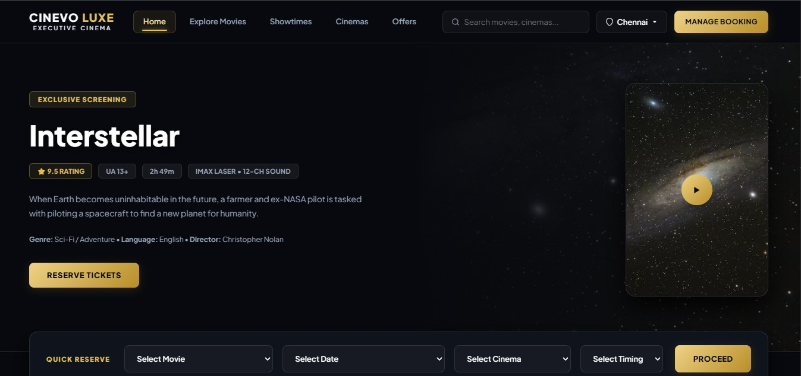
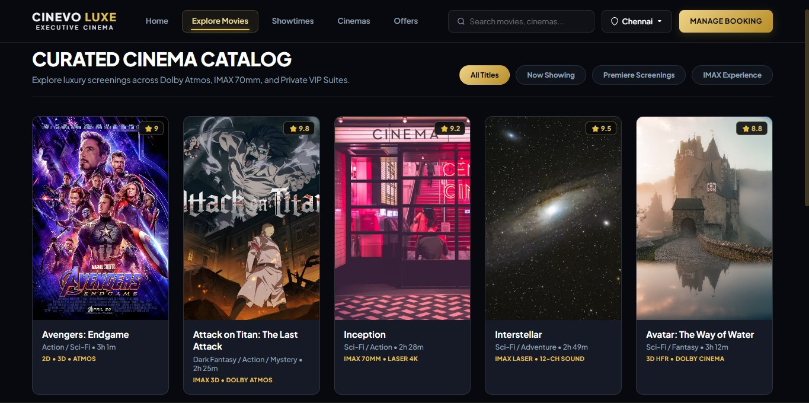
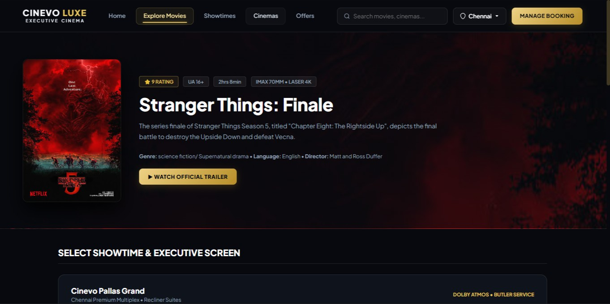
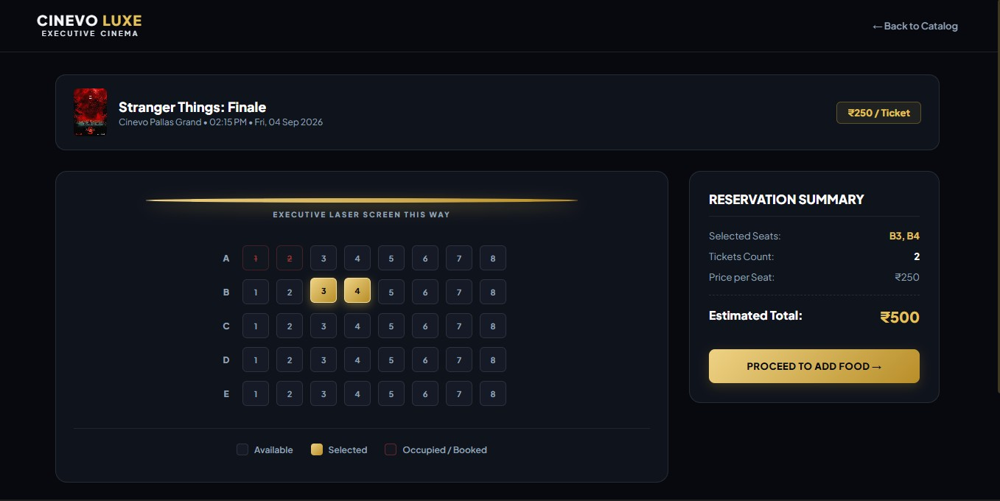
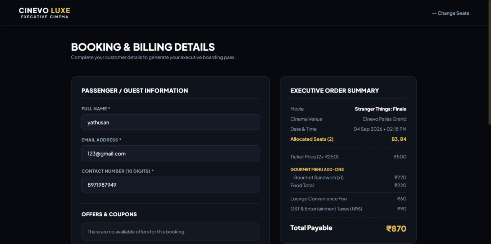
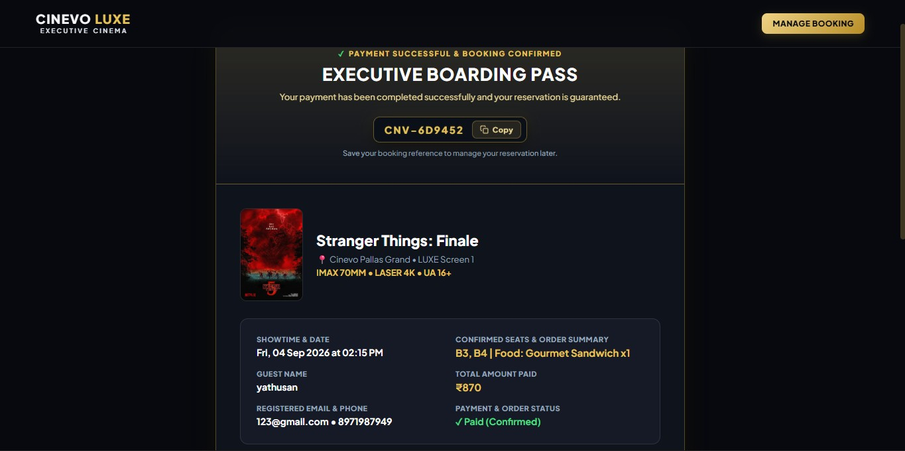
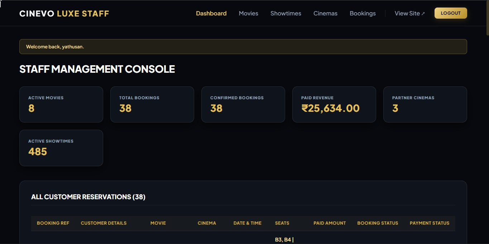

# 🎬 CINEVO LUXE

## Full-Stack Cinema Ticket Booking & Reservation Management Platform

**CINEVO LUXE** is a production-deployed full-stack cinema booking platform built with **Python, Flask, SQLAlchemy, SQLite, HTML, CSS, and JavaScript**.

It provides a complete customer booking workflow — from discovering movies and selecting showtimes to choosing seats, completing checkout, and receiving a digital booking confirmation.

The project also includes a **protected staff administration portal** for managing cinema content and operational data.

### 🌐 Live Application

**https://cinevo-luxe.onrender.com**

### 💻 Source Code

**https://github.com/Yathusan-tech/cinevo-luxe**

---

# ⚡ Project at a Glance

| Area | Implementation |
|---|---|
| **Application Type** | Full-Stack Cinema Booking Platform |
| **Backend** | Python + Flask |
| **ORM / Data Layer** | Flask-SQLAlchemy + SQLAlchemy |
| **Database** | SQLite |
| **Frontend** | HTML5 + CSS3 + JavaScript |
| **Authentication** | Staff authentication + password hashing |
| **Authorization** | Protected staff/admin routes |
| **Booking System** | Showtime-based seat reservation + availability validation |
| **Pricing** | Server-authoritative price calculation |
| **Security** | CSRF protection + input validation + security headers + secure sessions |
| **Data Integrity** | Transaction-aware booking operations + double-booking protection |
| **Deployment** | Render |
| **Source Control** | Git + GitHub |
| **Status** | Live and actively developed |

---

# 🎯 What I Built

CINEVO LUXE is not just a movie-listing website.

I built the application as a complete **reservation workflow**, where the frontend provides the user experience while the Flask backend and database enforce the important business rules.

### Customer side

```text
                    CUSTOMER
                       │
                       ▼
                Browse Movies
                       │
                       ▼
                Movie Details
                       │
                       ▼
              Select Showtime
                       │
                       ▼
                Select Seats
                       │
                       ▼
                   Checkout
                       │
                       ▼
          Server-Side Validation
                       │
                       ▼
             Booking Processing
                       │
                       ▼
            Database Reservation
                       │
                       ▼
          Digital Confirmation
```

### Staff side

```text
                    STAFF
                      │
                      ▼
                Staff Login
                      │
                      ▼
             Authentication
                      │
                      ▼
              Authorization
                      │
                      ▼
             Staff Dashboard
                      │
          ┌───────────┼───────────┐
          ▼           ▼           ▼
       Movies      Cinemas     Showtimes
          │           │           │
          └───────────┼───────────┘
                      ▼
                  Database
```

The result is a single application containing both a **customer booking system** and a **protected operational administration system**.

---

# 🏗️ System Architecture

The application follows a layered architecture where each layer has a specific responsibility.

```text

┌──────────────────────────────────────────────────────────────┐
│                       CINEVO LUXE                            │
└──────────────────────────────────────────────────────────────┘
                              │
                              ▼
┌──────────────────────────────────────────────────────────────┐
│                         FRONTEND                             │
│                                                              │
│              HTML5  │  CSS3  │  JavaScript                   │
│                                                              │
│  Movie UI → Showtimes → Seats → Checkout → Confirmation      │
└──────────────────────────────────────────────────────────────┘
                              │
                              │ HTTP Requests
                              ▼
┌──────────────────────────────────────────────────────────────┐
│                    FLASK APPLICATION                         │
│                         app.py                               │
│                                                              │
│  Routes │ Business Logic │ Validation │ Authentication       │
│                                                              │
│  ┌──────────────┐  ┌──────────────┐  ┌──────────────────┐    │
│  │ Customer     │  │ Booking      │  │ Staff/Admin      │    │
│  │ Routes       │  │ Logic        │  │ Routes           │    │
│  └──────────────┘  └──────────────┘  └──────────────────┘    │
│                                                              │
│  Security Controls                                           │
│  ├── CSRF Validation                                         │
│  ├── Input Validation                                        │
│  ├── Authentication                                          │
│  ├── Authorization                                           │
│  ├── Session Security                                        │
│  └── Security Headers                                        │
└──────────────────────────────────────────────────────────────┘
                              │
                              ▼
┌──────────────────────────────────────────────────────────────┐
│                    DATA / ORM LAYER                          │
│                         models.py                            │
│                                                              │
│              Flask-SQLAlchemy / SQLAlchemy                   │
│                                                              │
│  Movie │ Cinema │ Showtime │ Booking │ StaffUser             │
└──────────────────────────────────────────────────────────────┘
                              │
                              ▼
┌──────────────────────────────────────────────────────────────┐
│                           SQLite                             │
│                                                              │
│       Persistent movies, showtimes, bookings & staff data    │
└──────────────────────────────────────────────────────────────┘

```

### Architecture responsibility

**Frontend**

Handles presentation, interaction, seat selection UI, forms, and customer experience.

**Flask backend**

Handles routing, business rules, validation, authentication, authorization, booking processing, pricing, and security controls.

**SQLAlchemy**

Provides ORM-based interaction between the Python application and the database.

**SQLite**

Provides persistent storage for application data.

The important architectural principle is:

> **The browser provides the interface. The server enforces the rules.**

---

# 🔄 Complete Booking Architecture

The booking process is intentionally designed so that important values are revalidated on the server.

```text
Customer
   │
   ▼
Select Movie
   │
   ▼
Select Cinema
   │
   ▼
Select Showtime
   │
   ▼
Select Seats
   │
   ▼
Checkout Request
   │
   ▼
┌─────────────────────────────┐
│      FLASK BACKEND          │
│                             │
│ Validate Customer Data      │
│ Validate Seat Format        │
│ Detect Duplicate Seats      │
│ Verify Seat Availability    │
│ Verify Showtime             │
│ Calculate Ticket Amount     │
│ Apply Valid Booking Rules   │
└──────────────┬──────────────┘
               │
               ▼
        Database Transaction
               │
               ▼
        Create Reservation
               │
               ▼
       Generate Booking Ref
               │
               ▼
      Digital Confirmation
               │
               ▼
             User
```

This prevents the application from treating browser-submitted values as automatically trustworthy.

---

# 💺 Interactive Seat Reservation

The seat-selection system is one of the core features of CINEVO LUXE.

Customers can visually select seats before checkout.

However, the backend independently validates the submitted seat information.

### Backend checks include:

* Valid seat naming format
* Duplicate seat submissions
* Seat availability
* Seat ownership by the selected showtime
* Valid showtime/booking parameters
* Booking consistency during reservation creation

For example:

```text
Frontend says:

A1, A2, A3

        ↓

Backend receives request

        ↓

Validate:
✓ Valid seat format
✓ No duplicates
✓ Seats belong to showtime
✓ Seats are available

        ↓

Create reservation
```

The frontend therefore improves usability, while the backend remains responsible for correctness.

---

# 💳 Server-Authoritative Pricing

A major security decision in the application is that the server does **not blindly trust a total amount submitted by the browser**.

Instead:

```text
Selected Seats
      │
      ▼
Validated by Backend
      │
      ▼
Selected Showtime
      │
      ▼
Configured Showtime Price
      │
      ▼
Server-Side Calculation
      │
      ▼
Authoritative Total
      │
      ▼
Booking
```

This prevents a user from simply modifying a browser-side price and expecting the backend to accept it.

The backend determines the amount using trusted application/database data.

---

# 🛡️ Booking Integrity & Double-Booking Protection

A cinema reservation system must handle a fundamental problem:

> What happens if two booking requests attempt to reserve the same seat?

CINEVO LUXE handles seat availability on the backend rather than relying only on the visual state of the seat-selection page.

During booking processing:

1. Submitted seats are validated.
2. Duplicate seats are rejected.
3. Existing reservations are checked.
4. Seat availability is verified against the database.
5. Booking data is created using transaction-aware database operations.
6. The reservation is only completed when the required validation succeeds.

This approach helps maintain consistent booking state and reduces the risk of duplicate reservations.

---

# 🎟️ Digital Booking Confirmation

After a successful reservation, the customer receives a dedicated confirmation page.

The confirmation provides:

* Booking reference
* Movie
* Cinema
* Date
* Showtime
* Selected seats
* Customer information
* Total amount
* QR representation

The page also supports a print-friendly confirmation experience.

```text
Successful Booking
        │
        ▼
Generate Booking Reference
        │
        ▼
Store Reservation
        │
        ▼
Confirmation Page
        │
        ├── Booking Details
        ├── Seat Information
        ├── Total Amount
        └── QR Representation
```

---

# 🔎 Protected Reservation Lookup

Instead of exposing all reservations through a public booking list, the application provides a protected lookup flow.

The customer supplies information such as:

```text
Booking Reference
       +
Email / Phone
       │
       ▼
Backend Verification
       │
       ▼
Matching Reservation
       │
       ▼
Booking Details
```

This design reduces unnecessary exposure of other customers' reservation information.

---

# 👨‍💼 Staff Administration Portal

CINEVO LUXE includes a separate staff administration environment.

Staff members authenticate through protected staff routes before accessing administrative functionality.

The staff environment includes functionality for areas such as:

* Staff authentication
* Staff dashboard
* Movie management
* Cinema management
* Showtime management
* Booking-related administration

The application therefore demonstrates both:

**Customer-facing functionality**

and

**Protected staff functionality**

within the same backend.

---

# 🔐 Security Architecture

Security was considered during backend development rather than treated as a final cosmetic feature.

## 1. Authentication

Staff authentication is implemented using Flask application logic with **Werkzeug password hashing**.

Passwords are not intended to be stored as plaintext credentials.

---

## 2. Authorization

Authentication and authorization are treated as separate concerns.

A user being authenticated does not automatically grant access to staff functionality.

Protected staff routes verify that the request belongs to an authorized staff session.

---

## 3. CSRF Protection

The application implements CSRF protection for relevant state-changing requests.

The flow is:

```text
POST Request
    │
    ▼
CSRF Token
    │
    ▼
Token Validation
    │
    ├── Valid → Continue
    │
    └── Invalid/Missing → Reject
```

This helps protect state-changing endpoints against cross-site request forgery.

---

## 4. Server-Side Input Validation

Client input is treated as untrusted.

The backend validates important booking and customer data independently.

Examples include:

* Seat values
* Duplicate seats
* Seat availability
* Booking parameters
* Customer information
* Promotional conditions
* Other booking-related inputs

---

## 5. Secure Session Configuration

Session-related configuration includes security-focused settings designed to reduce common session risks.

---

## 6. Security Headers

The application includes security-related HTTP response headers to establish a stronger browser security baseline.

---

## 7. Environment-Based Secrets

Production-sensitive secrets are not intended to be stored directly in source code.

The Flask secret key is supplied through an environment variable.

```text
Application Code
      │
      └── reads environment variable
                    │
                    ▼
             Production Secret
```

This keeps deployment-specific sensitive configuration outside the repository.

---

# 🧠 Git Security & Secret Rotation

During development, I identified that a previously used development secret had existed in Git history.

This demonstrated an important version-control security lesson:

> **Deleting a secret from the latest source code does not remove it from previous Git commits.**

I addressed the issue by:

1. Generating a new production secret.
2. Rotating the production secret in the deployment environment.
3. Rewriting the affected Git history.
4. Removing the old secret from the rewritten history.
5. Verifying that the old value was no longer present in the cleaned history.
6. Force-updating the cleaned repository.

This was an important practical lesson in **Git history management and credential rotation**.

---

# 🗄️ Database Design

CINEVO LUXE uses:

**SQLite + SQLAlchemy / Flask-SQLAlchemy**

The main application entities are:

```text
                    DATABASE
                       │
        ┌──────────────┼──────────────┐
        │              │              │
        ▼              ▼              ▼
      Movie         Cinema        Showtime
                                      │
                                      ▼
                                   Booking
                                      │
                                      ▼
                                Customer Data

                    StaffUser
                       │
                       ▼
                Staff Authentication
```

### Movie

Stores movie information used by the customer-facing catalogue.

### Cinema

Represents cinema venues.

### Showtime

Associates movies with scheduled showtimes and configured ticket pricing.

### Booking

Stores reservation information such as:

* Booking reference
* Movie
* Cinema
* Date
* Time
* Selected seats
* Total amount
* Customer name
* Customer email
* Customer phone
* Creation timestamp

### StaffUser

Stores staff authentication information, including securely handled password credentials.

---

# 🧩 Core Backend Responsibilities

The Flask backend is responsible for much more than serving HTML pages.

```text
                    Flask Backend
                         │
      ┌──────────────────┼──────────────────┐
      │                  │                  │
      ▼                  ▼                  ▼
   Routing          Business Logic       Security
      │                  │                  │
      ▼                  ▼                  ▼
   Movies             Booking           Authentication
   Cinemas            Pricing            Authorization
   Showtimes          Seats              CSRF
   Checkout           Promotions         Validation
   Confirmation       Lookup             Headers
```

This separation allows the application to keep important business decisions on the server.

---

# 📋 Main Application Features

## Customer Features

* Movie catalogue
* Movie details
* Cinema browsing
* Dynamic showtimes
* Interactive seat selection
* Checkout
* Server-side price calculation
* Seat availability verification
* Booking creation
* Booking reference generation
* Digital booking confirmation
* QR representation
* Protected reservation lookup
* Offers/promotional logic

## Staff Features

* Staff login
* Protected staff dashboard
* Movie management
* Cinema management
* Showtime management
* Booking administration

## Security Features

* Password hashing
* Authentication
* Authorization
* CSRF protection
* Server-side input validation
* Server-authoritative pricing
* Seat validation
* Double-booking protection
* Security headers
* Secure session configuration
* Environment-based secrets

---

# 📁 Project Structure

```text
cinevo-luxe/
│
├── app.py
├── models.py
├── requirements.txt
├── README.md
├── .gitignore
├── .env.example
│
├── data/
│   └── movies.json
│
├── screenshots/
│   ├── addvenue.jpg
│   ├── catalog.jpg
│   ├── checkout.jpg
│   ├── checkoutdetails.jpg
│   ├── foodselection.jpg
│   ├── home.jpg
│   ├── moviedetail.jpg
│   ├── seatselection.jpg
│   ├── staffdashboard.jpg
│   └── staflogin.jpg
│
├── static/
│   ├── css/
│   │   └── style.css
│   └── favicon.svg
│
└── templates/
    ├── 404.html
    ├── 500.html
    ├── base.html
    ├── home.html
    ├── movies.html
    ├── movie_details.html
    ├── showtimings.html
    ├── cinemas.html
    ├── offers.html
    ├── bookings.html
    ├── seat_selection.html
    ├── checkout.html
    ├── confirmation.html
    ├── ...
    │
    └── staff/
        ├── base_staff.html
        ├── login.html
        ├── dashboard.html
        ├── movies.html
        ├── bookings.html
        ├── cinemas.html
        ├── showtimes.html
        └── ...
```

> Local `.env` files, virtual environments, database files, backup files, and other local artifacts are excluded from version control through `.gitignore`.

---

# 📸 Application Screenshots

## 🏠 Homepage



The main entry point to the CINEVO LUXE cinema experience.

---

## 🎬 Movie Catalogue



Customers can browse the available movie catalogue.

---

## 🎞️ Movie Details



Displays movie information and booking options.

---

## 💺 Seat Selection



Interactive interface for selecting available seats.

---

## 💳 Checkout



Review reservation information before the booking is processed.

---

## 🎟️ Booking Confirmation



Displays the completed reservation and booking reference.

---

## 👨‍💼 Staff Dashboard



Protected administrative interface for authorized staff users.

---

# 🧪 Testing & Verification

Testing was performed against both normal user flows and security-sensitive backend behavior.

### Functional testing

* Application startup
* Core routes
* Movie browsing
* Movie details
* Cinema handling
* Showtime handling
* Seat selection
* Checkout
* Booking processing
* Booking confirmation
* Reservation lookup
* Staff authentication
* Staff administration

### Security-focused testing

* Invalid seat input
* Duplicate seat submissions
* Already-booked seats
* Server-side price manipulation attempts
* CSRF validation
* Unauthorized staff access
* Security headers
* Environment-based secret configuration
* Database integrity
* Dependency security auditing

The purpose of testing was not only to confirm that the application works during normal usage, but also to verify that important backend rules remain enforced when requests are manipulated.

---

# 🛠️ Technology Stack

### Backend

* Python
* Flask
* Flask-SQLAlchemy
* SQLAlchemy
* Werkzeug

### Frontend

* HTML5
* CSS3
* JavaScript
* Responsive UI
* Custom cinema-focused design

### Database

* SQLite

### Security

* Password hashing
* Authentication
* Authorization
* CSRF protection
* Server-side validation
* Security headers
* Secure session configuration
* Environment-based secrets
* Transaction-aware booking operations

### Development & Deployment

* Git
* GitHub
* Render

---

# 🚀 Running Locally

## 1. Clone the repository

```bash
git clone https://github.com/Yathusan-tech/cinevo-luxe.git
```

## 2. Enter the project

```bash
cd cinevo-luxe
```

## 3. Create a virtual environment

### Windows

```bash
python -m venv .venv
```

Activate it:

```bash
.venv\Scripts\activate
```

### Linux / macOS

```bash
python3 -m venv .venv
```

```bash
source .venv/bin/activate
```

## 4. Install dependencies

```bash
pip install -r requirements.txt
```

## 5. Configure environment variables

Create a local `.env` file using `.env.example` as a reference.

Example:

```text
SECRET_KEY=your-development-secret
```

Use your own secure value.

**Never commit `.env` to Git.**

## 6. Start the application

```bash
python app.py
```

Then open the local Flask URL displayed in the terminal.

---

# ☁️ Deployment

The application is publicly deployed using **Render**.

```text
Local Development
       │
       ▼
      Git
       │
       ▼
    GitHub
       │
       ▼
    Render
       │
       ▼
Public Application
```

### Live Application

**https://cinevo-luxe.onrender.com**

The deployment uses environment-based configuration for sensitive production values.

---

# 💡 Key Engineering Decisions

## 1. Do not trust the browser

The frontend is treated as an interface rather than an authority.

Important values are revalidated on the backend.

---

## 2. Calculate prices on the server

The backend calculates the authoritative booking amount using validated seats and trusted showtime pricing.

---

## 3. Validate seats independently

Interactive frontend seat selection is backed by independent server-side validation.

---

## 4. Protect staff functionality

Staff routes require authentication and authorization rather than relying on hidden frontend links.

---

## 5. Protect state-changing requests

CSRF protection is applied to relevant state-changing requests.

---

## 6. Keep secrets outside source code

Production-sensitive values are provided through environment configuration.

---

## 7. Protect reservation lookup

Customers must provide identifying information to retrieve a reservation rather than receiving unrestricted booking data.

---

## 8. Maintain booking consistency

Reservation creation uses transaction-aware database operations and availability checks to help maintain consistent booking state.

---

# 📚 What This Project Demonstrates

CINEVO LUXE demonstrates practical experience in several areas of software development.

### Backend Development

Building a Flask application with multiple routes, business rules, validation, and database integration.

### Database Development

Designing and working with persistent relational data through SQLAlchemy and SQLite.

### Full-Stack Development

Connecting a customer-facing frontend with backend services and persistent data.

### Authentication & Authorization

Implementing protected staff functionality and password hashing.

### Application Security

Applying CSRF protection, server-side validation, security headers, secure session configuration, and environment-based secrets.

### Booking Systems

Designing seat availability checks, reservation processing, server-side pricing, and booking confirmation.

### Version Control

Using Git and GitHub for source control, including practical handling of sensitive information in Git history.

### Deployment

Taking the application from local development to a publicly accessible production deployment.

---

# 🧠 Key Lessons Learned

One of the biggest lessons from building CINEVO LUXE was that a web application cannot rely on the assumption that users will always interact with the frontend normally.

A user can modify requests, submit unexpected values, manipulate browser-side information, or attempt to access routes directly.

That led to an important design principle throughout the project:

> **Frontend controls improve the user experience. Backend controls protect the application.**

I also learned that security extends beyond application code.

For example, when a development secret was discovered in Git history, simply removing it from the latest version was not enough. The secret had to be rotated and removed from the repository history.

These experiences helped me understand practical software engineering beyond simply making an application "work."

---

# 📈 Project Status

## 🟢 Live & Actively Developed

CINEVO LUXE currently provides:

* Full movie discovery workflow
* Movie details
* Dynamic showtimes
* Interactive seat selection
* Server-side seat validation
* Seat availability checking
* Server-authoritative pricing
* Booking creation
* Digital booking confirmation
* QR representation
* Protected reservation lookup
* Staff authentication
* Staff administration
* Security controls
* Database persistence
* Production deployment

---

# 🔮 Future Improvements

The current architecture can be extended with:

* Online payment gateway integration
* Automated email ticket delivery
* Expanded staff management
* Advanced analytics and reporting
* More comprehensive automated tests
* Production monitoring
* Additional notification systems
* Expanded reservation management

These improvements can be added without replacing the core booking architecture.

---

# 📄 License

This project is intended for **educational, portfolio, and demonstration purposes**.

---

# 🔐 Security Notice

Sensitive information must never be committed to the repository.

This includes:

* Passwords
* API keys
* Secret keys
* Database credentials
* Authentication tokens
* `.env` files
* Private deployment configuration

Sensitive configuration should be provided through secure environment variables or deployment configuration.

No web application can honestly be guaranteed to be completely vulnerability-free.

CINEVO LUXE therefore treats security as an ongoing engineering responsibility involving secure development practices, validation, testing, dependency maintenance, and continuous improvement.

---

# ⭐ Final Project Summary

## CINEVO LUXE

**A full-stack cinema reservation platform demonstrating frontend development, backend engineering, database integration, security, booking integrity, authentication, and cloud deployment.**

### What I built

**Customer Experience**

Movie discovery → Movie details → Showtimes → Seat selection → Checkout → Booking → Digital confirmation

**Backend Engineering**

Flask routes → Business logic → Validation → Pricing → Seat availability → Booking processing → Database persistence

**Security Engineering**

Authentication → Authorization → CSRF protection → Input validation → Security headers → Secure sessions → Environment-based secrets

**Administration**

Protected staff login → Dashboard → Movie management → Cinema/showtime management → Booking administration

**Deployment**

Git → GitHub → Render → Live production application

---

### 🌐 Live

**https://cinevo-luxe.onrender.com**

### 💻 Source

**https://github.com/Yathusan-tech/cinevo-luxe**

---

> **CINEVO LUXE was built to demonstrate how a real-world web application combines user experience, backend business logic, persistent data, security controls, and deployment into one complete system.**
